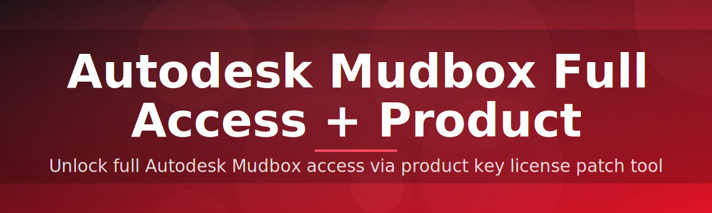

# 🗿 Mudbox License Configurator

### ⭐ Star this repo if it helped you!

  

---

## Table of Contents

- [About](#about)
- [Requirements](#requirements)
- [Features](#features)
- [Installation](#installation)
- [FAQ](#faq)
- [Community & Support](#community--support)
- [License](#license)
- [Disclaimer](#disclaimer)
- [Download](#download)

---

## About

This project started as a small internal utility for a two-person freelance studio that kept running into the same wall: switching between trial installs of Autodesk Mudbox on different render workstations without a clean way to re-check license state after reinstalling Windows or moving a machine between projects. What began as a handful of scripts to sanity-check local license files grew into a single packaged tool that handles the whole configuration flow end-to-end.

<strong>What this tool actually does</strong>

Mudbox License Configurator is a standalone Windows executable that walks through the local Autodesk Mudbox license configuration on your machine, applies the correct product key entry format, and verifies that the application launches in full-access mode without repeated activation prompts. No source build, no Python environment, no package manager — just one `.exe`.

> [!NOTE]
> The tool only touches local configuration files used by Mudbox's licensing subsystem. It does not modify Autodesk servers or any online account data.

> [!TIP]
> Run the tool once after a fresh install of Mudbox and once after any major Windows update — driver and system updates occasionally reset local license state.

---

## Requirements

<strong>System requirements</strong>

- Windows 10 (64-bit) or Windows 11
- Autodesk Mudbox 2026 installed
- Administrator rights on the local machine
- ~50 MB free disk space
- No internet connection required after download

> [!IMPORTANT]
> This is a Windows-only `.exe`. There is no macOS or Linux build, and there are no Python/pip installation steps — attempting to run it through a script interpreter will not work.

---

## Features

- Single portable `.exe` — no installer, no background service
- Automatic detection of existing Mudbox install path
- Full-access license configuration in one pass
- Product key formatting and validation before it's applied
- Rollback of local config to previous state if something looks wrong
- Clean logging window so you can see exactly what changed
- Works offline once downloaded
- Lightweight — starts and finishes in seconds

---

## Installation

<strong>Step-by-step setup</strong>

1. Download the archive from the [Download](#download) button below.
2. Extract the `.zip` to any local folder (Desktop or Downloads both work fine).
3. Right-click the extracted `.exe` and choose **Run as administrator**.
4. Follow the on-screen prompts, then relaunch Mudbox to confirm full access.

---

## FAQ

<strong>Common questions</strong>

**Does this require a Python environment or any dependencies?**
No. It is a self-contained Windows executable — download and run.

**Will this work on a fresh Mudbox install?**
Yes, it detects the install path automatically and configures it from a clean state.

**Do I need to disable my antivirus?**
Some antivirus tools flag license-configuration utilities as suspicious by default because they touch local license files. Review the tool yourself before whitelisting anything.

> [!TIP]
> If Windows SmartScreen blocks the file on first run, click "More info" → "Run anyway." This is expected behavior for unsigned executables, not an indicator of a problem.

**Does this affect my existing Autodesk account?**
No, all operations are local to your machine and do not sync with or alter your Autodesk account.

---

## Community & Support

Questions, bug reports, and feature requests are welcome through GitHub Issues on this repository. Please include your Windows version and Mudbox version when reporting a problem so it can be reproduced accurately. Pull requests that improve documentation or logging clarity are also welcome.

---

## License

Released under the **MIT License**, 2026. See the `LICENSE` file in this repository for full terms.

---

## Disclaimer

> [!CAUTION]
> This tool modifies local licensing configuration for Autodesk Mudbox. Use it only on installations you own or are authorized to configure. The maintainers of this repository are not affiliated with, endorsed by, or sponsored by Autodesk, Inc. "Autodesk" and "Mudbox" are trademarks of their respective owners, referenced here for identification purposes only.

> [!WARNING]
> Back up your Mudbox configuration folder before running any license tool. While this project includes a rollback option, you are responsible for any data loss or downtime resulting from its use.

---

## Download

  

